# Проєктування бази даних

В рамках проекту розробляється: 
- модель бізнес-об'єктів 
- ER-модель
- реляційна схема

- модель бізнес-об'єктів

```plantuml
@startuml
entity User <<ENTITY>> #ffc400
entity User.password <<TEXT>> #ffbdfe
entity User.email <<TEXT>> #ffbdfe
entity User.username <<TEXT>> #ffbdfe
entity User.role <<TEXT>> #ffbdfe
entity User.id <<UUID>> #ffbdfe

entity User_has_Search <<ENTITY>> #ffc400
entity User_has_Search.User_Id <<UUID>> #ffbdfe
entity User_has_Search.Search_id <<UUID>> #ffbdfe

entity Search <<ENTITY>> #ffc400
entity Search.id <<UUID>> #ffbdfe
entity Search.status <<TEXT>> #ffbdfe
entity Search.searchType <<TEXT>> #ffbdfe
entity Search.target <<TEXT>> #ffbdfe
entity Search.parameters <<TEXT>> #ffbdfe

entity Search_has_DataLink <<ENTITY>> #ffc400
entity Search_has_DataLink.User_Id <<UUID>> #ffbdfe
entity Search_has_DataLink.DataLink_link <<TEXT>> #ffbdfe

entity Attributes <<ENTITY>> #ffc400
entity Attributes.description <<TEXT>> #ffbdfe
entity Attributes.value <<TEXT>> #ffbdfe
entity Attributes.attributeType <<TEXT>> #ffbdfe
entity Attributes.name <<TEXT>> #ffbdfe
entity Attributes.id <<UUID>> #ffbdfe

entity DataFolder <<ENTITY>> #ffc400
entity DataFolder.description <<TEXT>> #ffbdfe
entity DataFolder.date <<DATETIME>> #ffbdfe
entity DataFolder.owner <<TEXT>> #ffbdfe
entity DataFolder.name <<TEXT>> #ffbdfe
entity DataFolder.id <<UUID>> #ffbdfe

entity DataFolder_has_DataLink <<ENTITY>> #ffc400
entity DataFolder_has_DataLink.DataFolder_id <<UUID>> #ffbdfe
entity DataFolder_has_DataLink.DataLink_link <<UUID>> #ffbdfe

entity DataLink <<ENTITY>> #ffc400
entity DataLink.link <<TEXT>> #ffbdfe

entity DataLink_has_Data <<ENTITY>> #ffc400
entity DataLink_has_Data.Data_id <<UUID>> #ffbdfe
entity DataLink_has_Data.DataLink_link <<UUID>> #ffbdfe

entity Permissions <<ENTITY>> #ffc400
entity Permissions.id <<UUID>> #ffbdfe
entity Permissions.name <<TEXT>> #ffbdfe
entity Permissions.description <<TEXT>> #ffbdfe
entity Permissions.level <<INT>> #ffbdfe

entity Data <<ENTITY>> #ffc400
entity Data.size <<DOUBLE>> #ffbdfe
entity Data.date <<DATETIME>> #ffbdfe
entity Data.dataType <<TEXT>> #ffbdfe
entity Data.name <<TEXT>> #ffbdfe
entity Data.id <<UUID>> #ffbdfe
entity Data.description <<TEXT>> #ffbdfe
entity Data.tags <<TEXT>> #ffbdfe
entity Data.createBy <<UUID>> #ffbdfe

entity UserAttributes <<ENTITY>> #ffc400
entity UserAttributes.UserID <<UUID>> #ffbdfe
entity UserAttributes.AttributeID <<UUID>> #ffbdfe

User.password -d-* User
User.email -d-* User
User.username -d-* User
User.id -d-* User
User.role -d-* User

User_has_Search.User_Id -u-* User_has_Search
User_has_Search.Search_id -u-* User_has_Search

Search.id -u-* Search
Search.status -u-* Search
Search.searchType -u-* Search
Search.target -u-* Search
Search.parameters -u-* Search

Search_has_DataLink.User_Id -u-* Search_has_DataLink
Search_has_DataLink.DataLink_link -u-* Search_has_DataLink

Attributes.description -d-* Attributes
Attributes.value -d-* Attributes
Attributes.attributeType -d-* Attributes
Attributes.name -d-* Attributes
Attributes.id -d-* Attributes

DataFolder.description -d-* DataFolder
DataFolder.date -d-* DataFolder
DataFolder.owner -d-* DataFolder
DataFolder.name -d-* DataFolder
DataFolder.id -d-* DataFolder

DataLink.link -u-* DataLink

DataLink_has_Data.Data_id -u-* DataLink_has_Data
DataLink_has_Data.DataLink_link -u-* DataLink_has_Data

Data.size -d-* Data
Data.date -d-* Data
Data.dataType -d-* Data
Data.id -d-* Data
Data.name -d-* Data
Data.description -d-* Data
Data.tags -d-* Data
Data.createBy -d-* Data

UserAttributes.UserID -u-* UserAttributes
UserAttributes.AttributeID -u-* UserAttributes

Permissions.description -u-* Permissions
Permissions.level -u-* Permissions
Permissions.name -u-* Permissions
Permissions.id -u-* Permissions

DataFolder_has_DataLink.DataFolder_id -u-* DataFolder_has_DataLink
DataFolder_has_DataLink.DataLink_link -u-* DataFolder_has_DataLink

User "1" -u- "0" UserAttributes
User "1" -d- "0" User_has_Search
User_has_Search "0" -d- "1" Search
User "1" -r- "0" DataFolder
Search "1" -d- "0" Search_has_DataLink
Search_has_DataLink "0" -l- "1" DataLink
UserAttributes "0" -u- "1" Attributes
Attributes "1" -u- "0" Permissions

DataFolder "1" -r- "0" DataFolder_has_DataLink
DataFolder_has_DataLink "0" -r- "1" DataLink
DataLink "1" -r- "0" DataLink_has_Data
DataLink_has_Data "0" -r- "1" Data
@enduml
```

-ER-модель
```plantuml
@startuml
entity User  {
	id: UUID
	password: TEXT
	username: TEXT
	email: TEXT
	role: TEXT 	
}

entity UserAttributes  {
	UserID: UUID
	AttributeID: UUID
}

entity Search  {
	id: UUID
	status: TEXT
	searchType: TEXT
	target: TEXT
	parameters: TEXT
}

entity Search_has_DataLink {
	Search_id: UUID 
	DataLink_link: TEXT
}

entity User_has_Search  {
	User_id: UUID
	Search_id: UUID
}

entity DataFolder  {
	id: UUID
	description: TEXT
	date: DATETIME 
	owner: TEXT
	name: TEXT
}

entity DataFolder_has_DataLink  {
	DataFolder_id: UUID
	DataLink_link: UUID
}

entity Data  {
	id: UUID
	size: DOUBLE
	date: DATETIME 
	dataType: TEXT
	name: TEXT
	description: TEXT
	tags: TEXT
	createdBy: UUID 
}

entity DataLink_has_Data  {
	Data_id: UUID
	DataLink_link: UUID
}

entity Attributes  {
	id: UUID
	description: TEXT
	value: TEXT
	attributeType: TEXT
	name: TEXT
}

entity Permissions  {
	id: UUID
	description: TEXT
	level: INT
	name: TEXT
}

entity DataLink  {
	link: TEXT
}

entity AdminActivityReports {
	id: UUID
	adminID: UUID
	activity: TEXT
	date: DATETIME
}

entity AdminRegistration {
	id: UUID
	adminID: UUID
	registeredBy: UUID 	
	date: DATETIME
}

entity GuestAccess {
	id: UUID
	dataID: UUID
	accessDate: DATETIME
	guestID: UUID
}

entity RemovedAdminData {
	id: UUID
	adminID: UUID
	removedBy: UUID 	
	dataID: UUID
	date: DATETIME
}

User "1,1" --> "0,*" UserAttributes
User "1,1" --> "0,*" User_has_Search
User_has_Search "0,*" --> "1,1" Search
User "1,1" --> "0,*" DataFolder
Search "1,1" --> "0,*" Search_has_DataLink
Search_has_DataLink "0,*" --> "1,1" DataLink
UserAttributes "0,*" --> "1,1" Attributes
Attributes "1,1" --> "0,*" Permissions

DataFolder "1,1" --> "0,*" DataFolder_has_DataLink
DataFolder_has_DataLink "0,*" --> "1,1" DataLink

DataLink "1,1" --> "0,*" DataLink_has_Data
DataLink_has_Data "0,*" --> "1,1" Data
AdminActivityReports "1,1" --> "1,1" User : adminID
AdminRegistration "1,1" --> "1,1" User : adminID
GuestAccess "0,*" --> "1,1" Data : dataID
RemovedAdminData "1,1" --> "1,1" User : adminID
RemovedAdminData "1,1" --> "1,1" Data : dataID
@enduml

