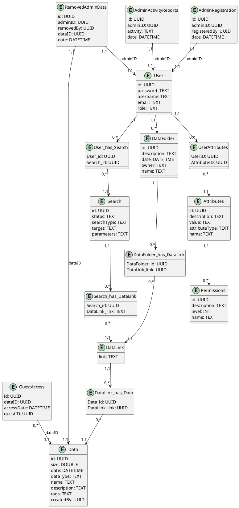

# Проєктування бази даних

В рамках проекту розробляється: 
- модель бізнес-об'єктів 
- ER-модель
- реляційна схема
  
-ER-модель

```plantuml
@startuml
entity User  {
	id: UUID
	password: TEXT
	username: TEXT
	email: TEXT
	role: TEXT 	
}

entity UserAttributes  {
	UserID: UUID
	AttributeID: UUID
}

entity Search  {
	id: UUID
	status: TEXT
	searchType: TEXT
	target: TEXT
	parameters: TEXT
}

entity Search_has_DataLink {
	Search_id: UUID 
	DataLink_link: TEXT
}

entity User_has_Search  {
	User_id: UUID
	Search_id: UUID
}

entity DataFolder  {
	id: UUID
	description: TEXT
	date: DATETIME 
	owner: TEXT
	name: TEXT
}

entity DataFolder_has_DataLink  {
	DataFolder_id: UUID
	DataLink_link: UUID
}

entity Data  {
	id: UUID
	size: DOUBLE
	date: DATETIME 
	dataType: TEXT
	name: TEXT
	description: TEXT
	tags: TEXT
	createdBy: UUID 
}

entity DataLink_has_Data  {
	Data_id: UUID
	DataLink_link: UUID
}

entity Attributes  {
	id: UUID
	description: TEXT
	value: TEXT
	attributeType: TEXT
	name: TEXT
}

entity Permissions  {
	id: UUID
	description: TEXT
	level: INT
	name: TEXT
}

entity DataLink  {
	link: TEXT
}

entity AdminActivityReports {
	id: UUID
	adminID: UUID
	activity: TEXT
	date: DATETIME
}

entity AdminRegistration {
	id: UUID
	adminID: UUID
	registeredBy: UUID 	
	date: DATETIME
}

entity GuestAccess {
	id: UUID
	dataID: UUID
	accessDate: DATETIME
	guestID: UUID
}

entity RemovedAdminData {
	id: UUID
	adminID: UUID
	removedBy: UUID 	
	dataID: UUID
	date: DATETIME
}

User "1,1" --> "0,*" UserAttributes
User "1,1" --> "0,*" User_has_Search
User_has_Search "0,*" --> "1,1" Search
User "1,1" --> "0,*" DataFolder
Search "1,1" --> "0,*" Search_has_DataLink
Search_has_DataLink "0,*" --> "1,1" DataLink
UserAttributes "0,*" --> "1,1" Attributes
Attributes "1,1" --> "0,*" Permissions

DataFolder "1,1" --> "0,*" DataFolder_has_DataLink
DataFolder_has_DataLink "0,*" --> "1,1" DataLink

DataLink "1,1" --> "0,*" DataLink_has_Data
DataLink_has_Data "0,*" --> "1,1" Data
AdminActivityReports "1,1" --> "1,1" User : adminID
AdminRegistration "1,1" --> "1,1" User : adminID
GuestAccess "0,*" --> "1,1" Data : dataID
RemovedAdminData "1,1" --> "1,1" User : adminID
RemovedAdminData "1,1" --> "1,1" Data : dataID
@enduml
```
