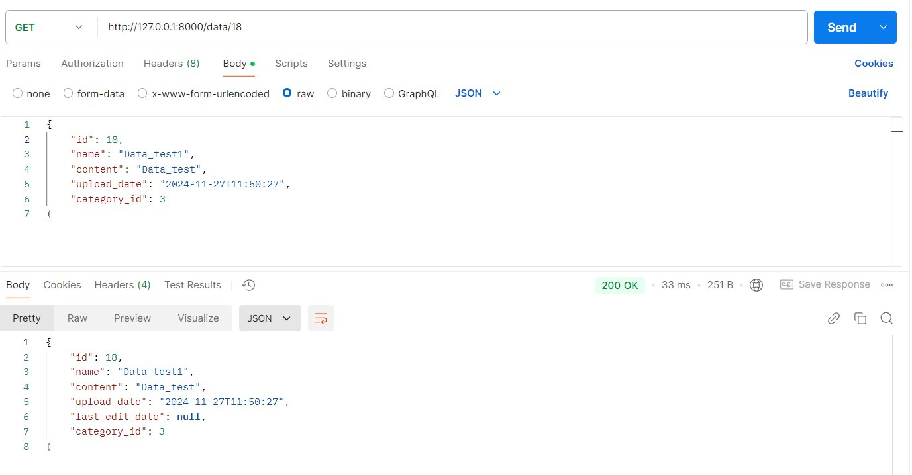
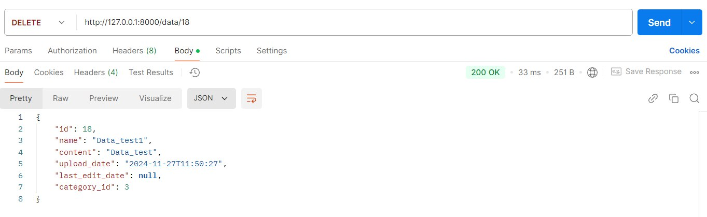
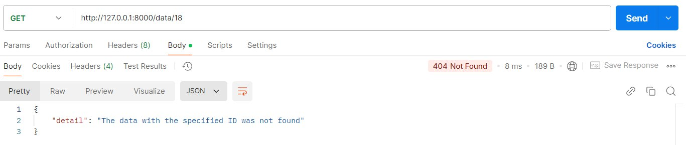
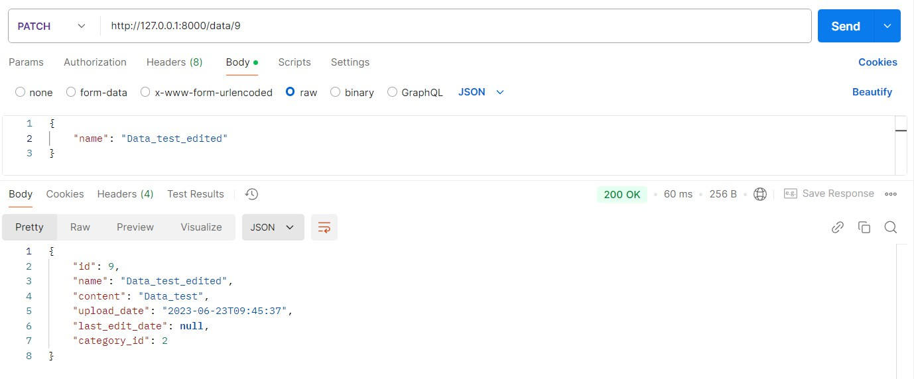
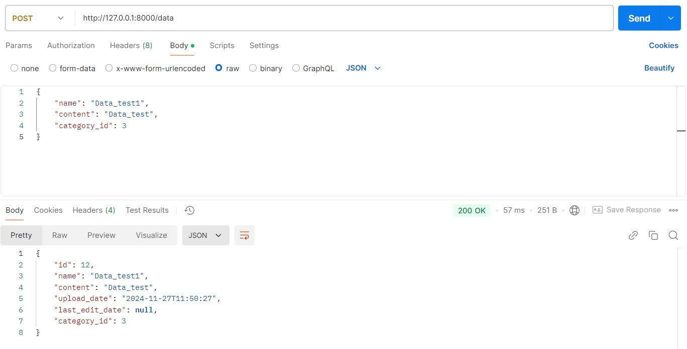
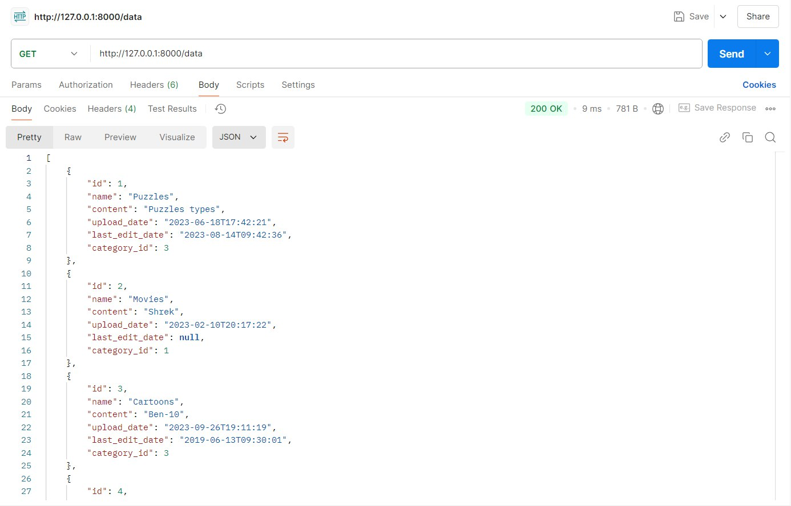
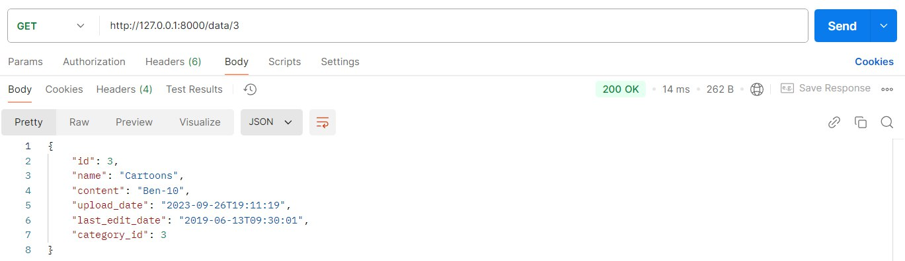

# Тестування працездатності системи

### DELETE
Delete-запит на видалення категорії

*Перевірка існування категорії*

*Видалення категорії*

*Перевірка видалення категорії*

### PATCH
Patch-запит на оновлення id

*Оновлення id*

### PUT
Put-запит на оновлення id, name, description

*Дані категорії до оновлення*

*Оновлення даних категорії*

### POST
Post-запит на додавання даних з усіма заповненими полями

Post-запит на додавання даних без id, upload_date, last_edit_date

### GET

Get-запит на отримання всіх даних

Get-запит на отримання даних за id

