# Тестування працездатності системи

## Зміст

- [Тестування працездатності системи](#тестування-працездатності-системи)
  - [Сценарій для Data](#сценарій-для-data)
  - [Вийнятки для Data](#вийнятки-для-data)

## Сценарій для Data
### GET
Запит на отримання даних

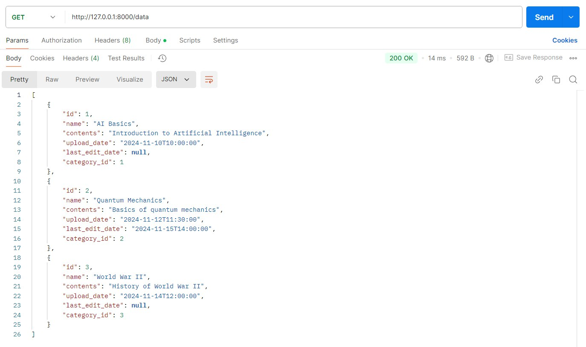

Запит на отримання даних за id

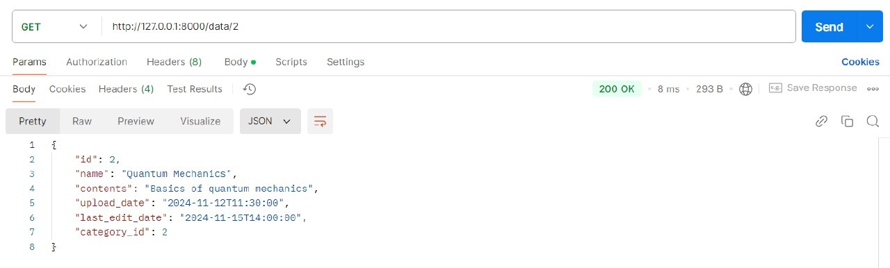

### POST
Запит на додавання даних з усіма заповненими полями

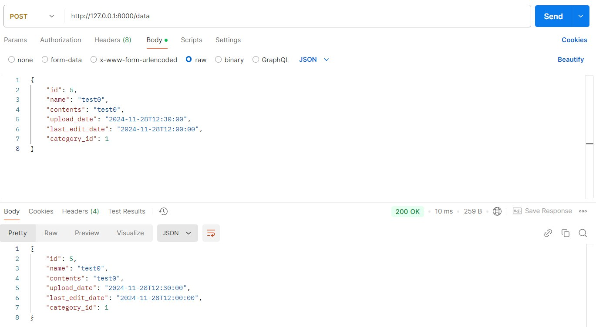

Запит на додавання даних без id, last_edit_date та upload_date

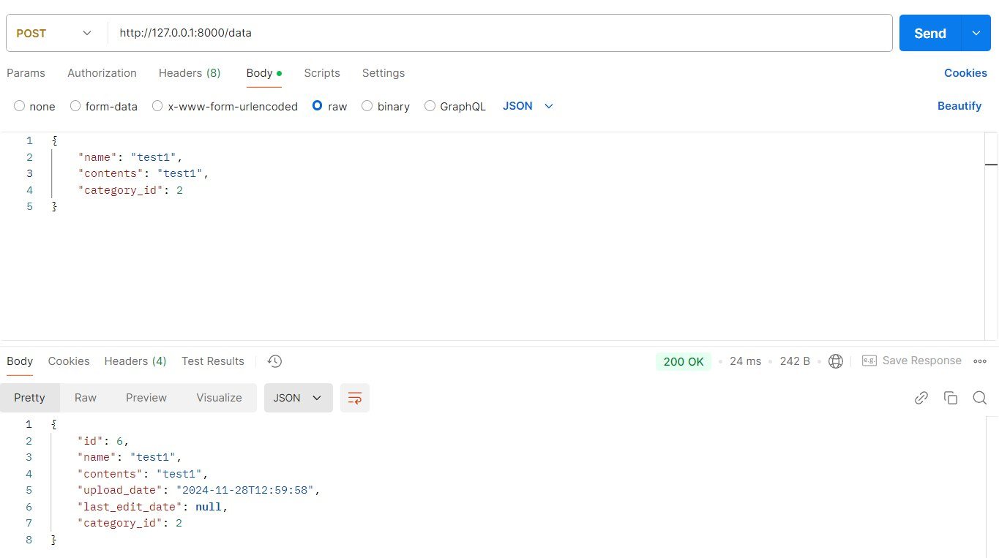

### PUT
Запит на оновлення id, name, content та category

Перед оновленням

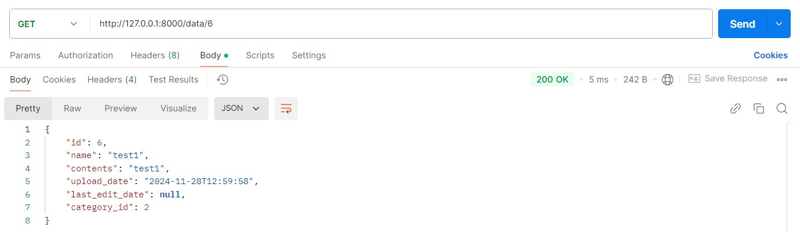

Після оновлення

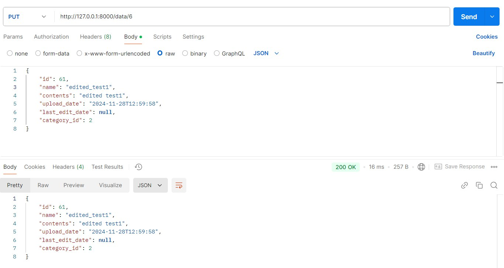

### DELETE
Перевірка даних на існування

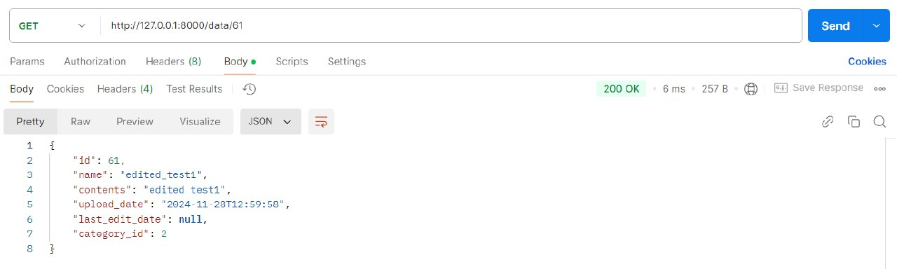

Запит на видалення даних

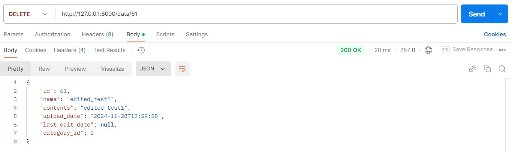

Перевірка видалених даних на існування

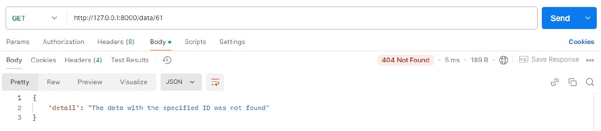

### PATCH
Запит на оновлення name

Перед оновленням

Після оновлення

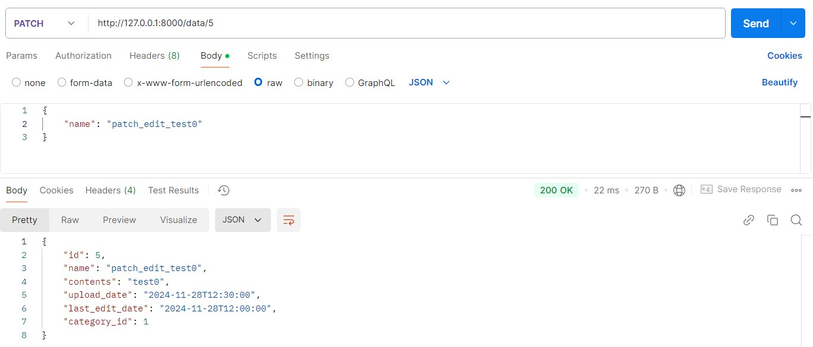

## Вийнятки для Data
### GET
Немає даних з певним id

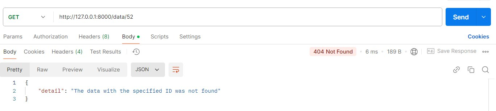

### POST
Введено не всі обов'язкові дані для заповнення

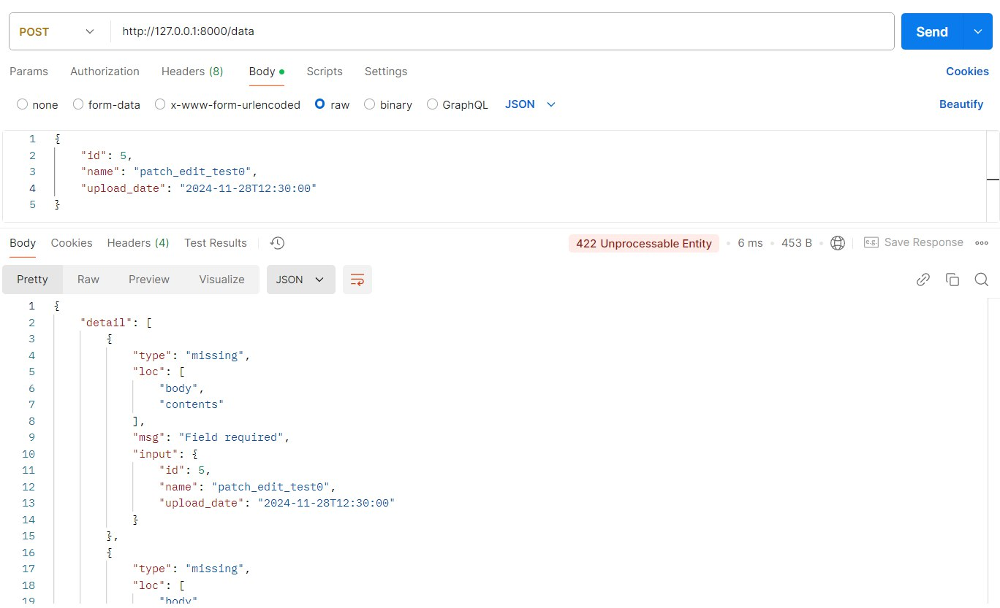

### PUT
Введено id, з яким дані вже існують у системі

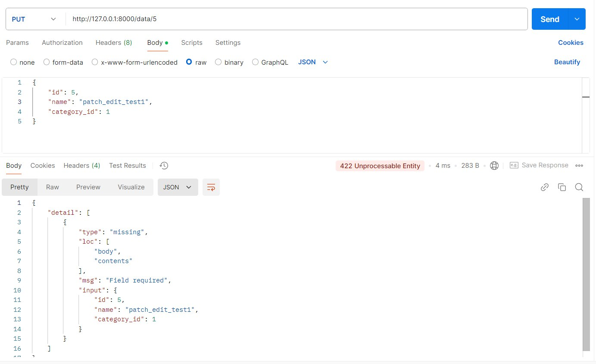

### DELETE
Немає даних із заданим id

### PATCH
Немає даних із заданим id

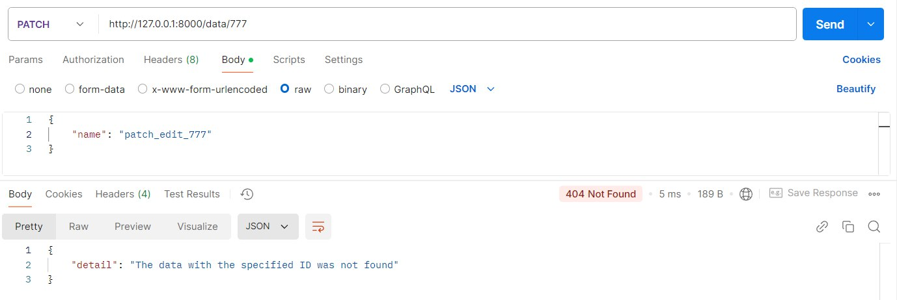
