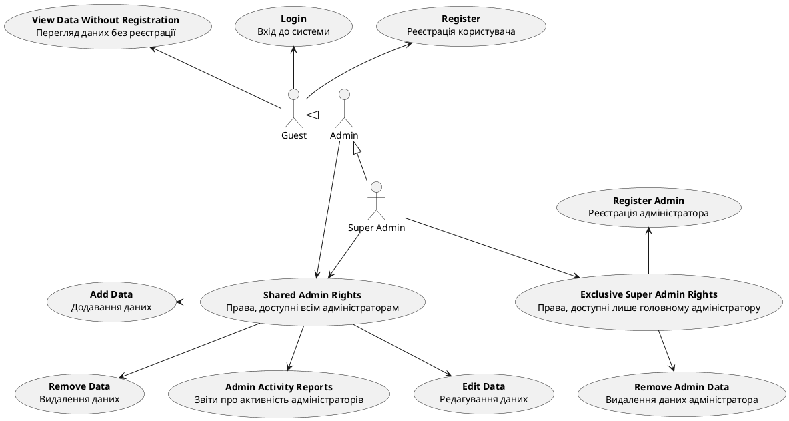
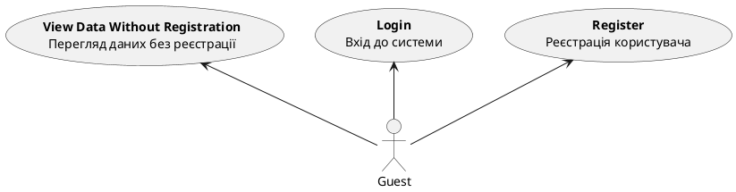
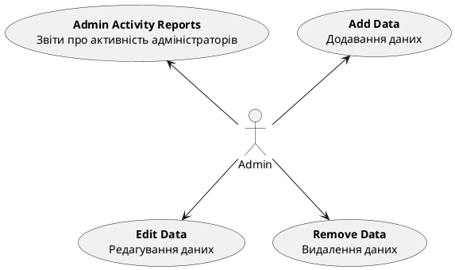
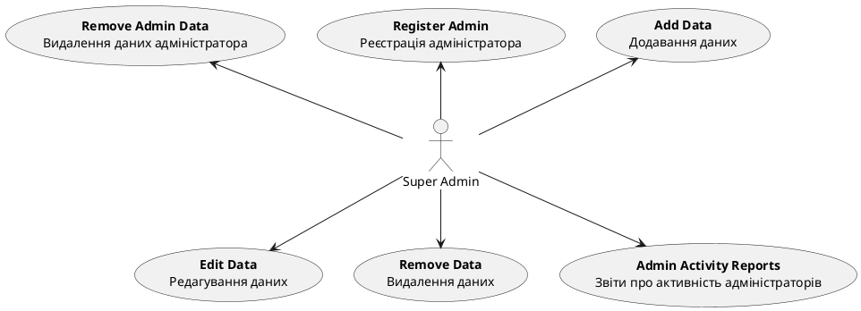

# Розроблення функціональних вимог до системи

## Модель прецедентів

### 1. Загальна схема

### 2. Схема взаємодії гостя

### 3. Схема взаємодії адміністраторів

### 4. Схема взаємодії суперадміністратора

### 1. Сценарій RegisterAdmin

| ID |	RegisterAdmin |
| :------------- | :------------- |
| НАЗВА |	Реєстрація адміністратора |
| УЧАСНИКИ |	Адміністратор, Система |
| ПЕРЕДУМОВИ |	Користувач має права на реєстрацію інших адміністраторів. |
| РЕЗУЛЬТАТ |	Новий адміністратор зареєстрований у системі. |
| ВИКЛЮЧНІ СИТУАЦІЇ |	Користувач без прав на реєстрацію. Не заповнені всі обов'язкові поля. Помилка підключення до бази даних.|
| ОСНОВНИЙ СЦЕНАРІЙ |	1. Користувач входить у систему. 2. Відкриває вкладку «Адміністратори». 3. Обирає «Зареєструвати адміністратора». 4. Вводить дані (ім'я, пошта, рівень доступу). 5. Натискає «Підтвердити». 6. Система перевіряє права користувача. 7. Система реєструє нового адміністратора та надає доступ.    |

@startuml

    |Адміністратор|
    start;
    : Входить у систему;
    
    |Система|
        : Відкриває вкладку "Адміністратори";
    
    |Адміністратор|
    : Обирає "Зареєструвати адміністратора";
    : Вводить дані (ім'я, пошта, рівень доступу);
    : Натискає кнопку "Підтвердити";
    note right #FF6969
    <b> Можлива
    <b> EmptyRequiredFields
    end note
    
    |Система|
    : Перевіряє права користувача;
    note right #FF6969
    <b> Можлива
    <b> NoRegistrationRights
    end note
    : Реєструє нового адміністратора;
    note right #FF6969
    <b> Можлива
    <b> DBConnectionError
    end note
    
    : Надає доступ новому адміністратору;
    : Повідомляє про успішну реєстрацію;
    stop;

@enduml

### 2. Сценарій ViewDataWithoutRegistration

| ID |	ViewDataWithoutRegistration |
| :------------- | :------------- |
| НАЗВА | 	Перегляд даних користувачами без реєстрації |
| УЧАСНИКИ |	Користувач, Система |
| ПЕРЕДУМОВИ |	Користувач не зареєстрований у системі. |
| РЕЗУЛЬТАТ |	Користувач може переглянути певні відкриті дані без реєстрації. |
| ВИКЛЮЧНІ СИТУАЦІЇ |	Помилка підключення до бази даних.  Відсутній доступ до відкритих даних через технічну помилку. |
| ОСНОВНИЙ СЦЕНАРІЙ |	1. Користувач заходить на головну сторінку з відкритими даними. 2. Обирає «Відкриті дані». 3. Система надає доступ до загальних даних без реєстрації. 4. Користувач переглядає доступні дані.   |

@startuml

    |Користувач|
    start;
    : Заходить на головну сторінку з відкритими даними;
    
    |Система|
        : Відкриває доступ до відкритих даних;
    
    |Користувач|
    : Обирає "Відкриті дані";
    
    |Система|
    : Надає доступ до загальних даних без реєстрації;
    note right #FF6969
    <b> Можлива
    <b> DBConnectionError
    end note
    : Користувач переглядає доступні дані;
    note right #FF6969
    <b> Можлива
    <b> TechnicalError
    end note
    stop;
    
@enduml

### 3. Сценарій RemoveAdminData

| ID |	RemoveAdminData |
| :------------- | :------------- |
| НАЗВА |	Видалення даних адміністратора |
| УЧАСНИКИ |	Адміністратор, Система |
| ПЕРЕДУМОВИ |	Адміністратор має права на видалення даних. |
| РЕЗУЛЬТАТ |	Дані адміністратора видалені з системи. |
| ВИКЛЮЧНІ СИТУАЦІЇ |	Неправильний пароль для підтвердження.  Недостатньо прав для видалення. |
| ОСНОВНИЙ СЦЕНАРІЙ |	1. Адміністратор входить у систему. 2. Відкриває вкладку «Управління адміністраторами». 3. Вибирає адміністратора для видалення. 4. Вводить пароль для підтвердження операції. 5. Система перевіряє права та видаляє адміністратора з бази даних.  

@startuml

    |Адміністратор|
    start;
    : Входить у систему;
    
    |Система|
        : Відкриває вкладку "Управління адміністраторами";
    
    |Адміністратор|
    : Вибирає адміністратора для видалення;
    : Вводить пароль для підтвердження операції;
    note right #FF6969
    <b> Можлива
    <b> IncorrectPassword
    end note
    
    |Система|
    : Перевіряє права адміністратора;
    note right #FF6969
    <b> Можлива
    <b> InsufficientPermissions
    end note
    : Видаляє адміністратора з бази даних;
    stop;

@enduml

### 4. Сценарій AdminActivityReports

| ID |	AdminActivityReports | 
| :------------- | :------------- |
| НАЗВА | Звіти про активність адміністраторів |
| УЧАСНИКИ |	Адміністратор, Система |
| ПЕРЕДУМОВИ |	Адміністратор має бути авторизованим. |
| РЕЗУЛЬТАТ |	Відображаються звіти про активність адміністраторів. |
| ВИКЛЮЧНІ СИТУАЦІЇ |	Серверна помилка.  Відсутні дані для звіту. |
| ОСНОВНИЙ СЦЕНАРІЙ |	1. Адміністратор відкриває вкладку «Звіти». 2. Вибирає тип звіту «Активність адміністраторів». 3. Система отримує дані з бази та відображає звіт. | 

@startuml

    |Адміністратор|
    start;
    : Відкриває вкладку "Звіти";
    
    |Система|
        : Відображає доступні типи звітів;
    
    |Адміністратор|
    : Вибирає тип звіту "Активність адміністраторів";
    
    |Система|
    : Отримує дані з бази;
    note right #FF6969
    <b> Можлива
    <b> ServerError
    end note
    : Відображає звіт про активність адміністраторів;
    note right #FF6969
    <b> Можлива
    <b> NoDataForReport
    end note
    stop;

@enduml

### 5. Сценарій SuperAdminPrivileges

| ID | 	SuperAdminPrivileges |
| :------------- | :------------- |
| НАЗВА | 	Привілеї головного адміністратора |
| УЧАСНИКИ | 	Головний адміністратор, Система |
| ПЕРЕДУМОВИ |	Користувач авторизований як головний адміністратор. |
| РЕЗУЛЬТАТ |	Головний адміністратор може додавати нових адміністраторів та видаляти існуючих. |
| ВИКЛЮЧНІ СИТУАЦІЇ |	Недостатньо прав для виконання дії.  Спроба видалити адміністратора, який виконує критичні системні функції. |
| ОСНОВНИЙ СЦЕНАРІЙ | Додавання нового адміністратора: 	1.Головний адміністратор входить у систему.  2.Відкриває вкладку «Управління адміністраторами».  3.Натискає «Додати нового адміністратора». 4.Система запитує інформацію про нового адміністратора (ПІБ, контактні дані, права доступу).  5.Головний адміністратор заповнює всі обов'язкові поля.  6.Натискає «Підтвердити». 7.Система перевіряє права головного адміністратора та додає нового адміністратора до системи.   Видалення адміністратора:  1. Головний адміністратор входить у систему. 2. Відкриває вкладку «Управління адміністраторами». 3. Обирає адміністратора, якого потрібно видалити.  4. Система запитує підтвердження видалення.  5. Головний адміністратор підтверджує видалення.  6. Система перевіряє права головного адміністратора та видаляє адміністратора з системи. |

@startuml

    |Головний адміністратор|
    start;
    : Входить у систему;
    
    |Система|
        : Відкриває вкладку "Управління адміністраторами";
    
    |Головний адміністратор|
    : Натискає "Додати нового адміністратора";
    
    |Система|
    : Запитує інформацію про нового адміністратора;
    
    |Головний адміністратор|
    : Заповнює всі обов'язкові поля;
    : Натискає "Підтвердити";
    
    |Система|
    : Перевіряє права головного адміністратора;
    note right #FF6969
    <b> Можлива
    <b> InsufficientPermissions
    end note
    : Додає нового адміністратора до системи;
    
    |Головний адміністратор|
    : Відкриває вкладку «Управління адміністраторами»;
    : Вибирає адміністратора, якого потрібно видалити;
    
    
    |Система|
    : Запитує підтвердження видалення;
    note right #FF6969
    <b> Можлива
    <b> CriticalAdminRemovalAttempt
    end note
    
    |Головний адміністратор|
    : Підтверджує видалення адміністратора;
    
    |Система|
    : Перевіряє права головного адміністратора;
    : Видаляє адміністратора з системи;
    stop;

@enduml

### 6. Сценарій EditAdminData

| ID | 	EditAdminData | 
| :------------- | :------------- |
| НАЗВА |	Зміна даних адміністраторів |
| УЧАСНИКИ |	Адміністратор, Система |
| ПЕРЕДУМОВИ |	Користувач авторизований як адміністратор. |
| РЕЗУЛЬТАТ |	Дані адміністратора успішно змінені. |
| ВИКЛЮЧНІ СИТУАЦІЇ |	Неправильні дані для редагування.  Недостатньо прав для зміни даних. |
| ОСНОВНИЙ СЦЕНАРІЙ |	1. Адміністратор входить у систему. 2. Адміністратор відкриває вкладку «Управління адміністраторами». 3. Адміністратор обирає адміністратора для зміни даних. 4. Система відкриває поля для редагування. 5. Адміністратор вносить зміни в необхідні поля. 6. Адміністратор натискає «Зберегти зміни». 7. Система перевіряє правильність введених даних та зберігає зміни. | 

@startuml

    |Адміністратор|
    start;
    : Входить у систему;
    
    |Система|
    : Відкриває вкладку "Управління адміністраторами";
    
    |Адміністратор|
    : Обирає адміністратора для зміни даних;
    
    |Система|
    : Відображає поля для редагування;
    
    |Адміністратор|
    : Вносить зміни в необхідні поля;
    : Натискає "Зберегти зміни";
    
    |Система|
    : Перевіряє правильність введених даних;
    note right #FF6969
    <b> Можлива
    <b> IncorrectData
    end note
    
    : Перевіряє права адміністратора;
    note right #FF6969
    <b> Можлива
    <b> InsufficientPermissions
    end note
    
    : Зберігає зміни до системи;
    
    stop;

@enduml

### 7. Сценарій RemoveData

| ID |	RemoveData |
| :------------- | :------------- |
| НАЗВА |	Видалення даних, доданих адміністратором |
| УЧАСНИКИ |	Адміністратор, Система |
| ПЕРЕДУМОВИ |	Адміністратор має права на видалення даних. |
| РЕЗУЛЬТАТ |	Дані успішно видалені з системи. |
| ВИКЛЮЧНІ СИТУАЦІЇ |	Неправильний пароль для підтвердження.  Недостатньо прав для видалення даних. |
| ОСНОВНИЙ СЦЕНАРІЙ |	1. Адміністратор входить у систему. 2. Адміністратор відкриває вкладку з управлінням даними. 3. Адміністратор вибирає дані, які необхідно видалити. 4. Система запитує підтвердження видалення. 5. Адміністратор підтверджує дію. 6. Система перевіряє права та видаляє дані з бази. |

@startuml

    |Адміністратор|
    start;
    : Входить у систему;
    
    |Система|
    : Відкриває вкладку з управлінням даними;
    
    |Адміністратор|
    : Вибирає дані, які необхідно видалити;
    
    |Система|
    : Запитує підтвердження видалення;
    
    |Адміністратор|
    : Вводить пароль для підтвердження;
    : Підтверджує дію;
    
    |Система|
    : Перевіряє пароль адміністратора;
    note right #FF6969
    <b> Можлива
    <b> IncorrectPassword
    end note
    
    : Перевіряє права адміністратора;
    note right #FF6969
    <b> Можлива
    <b> InsufficientPermissions
    end note
    
    : Видаляє дані з системи;
    
    stop;

@enduml

### 8. Сценарій AddData

| ID |	AddData |
| :------------- | :------------- |
| НАЗВА |	Додавання даних адміністратором |
| УЧАСНИКИ |	Адміністратор, Система |
| ПЕРЕДУМОВИ |	Адміністратор авторизований та має права на додавання даних. |
| РЕЗУЛЬТАТ	| Нові дані успішно додані до системи. |
| ВИКЛЮЧНІ СИТУАЦІЇ |	Неправильний формат введених даних.  Недостатньо прав для додавання даних. |
| ОСНОВНИЙ СЦЕНАРІЙ	| 1. Адміністратор входить у систему.  2. Адміністратор відкриває вкладку з управлінням даними.  3. Натискає «Додати нові дані».  4. Система відкриває форму для введення нових даних (наприклад, назва, опис, тип даних).  5. Адміністратор заповнює всі необхідні поля.  6. Адміністратор натискає «Зберегти».  7. Система перевіряє правильність даних і зберігає їх у базі. |

@startuml

    |Адміністратор|
    start;
    : Входить у систему;
    
    |Система|
    : Відкриває вкладку з управлінням даними;
    
    |Адміністратор|
    : Натискає "Додати нові дані";
    
    |Система|
    : Відкриває форму для введення нових даних;
    
    |Адміністратор|
    : Заповнює всі необхідні поля;
    : Натискає "Зберегти";
    
    |Система|
    : Перевіряє правильність введених даних;
    note right #FF6969
    <b> Можлива
    <b> IncorrectDataFormat
    end note
    
    : Перевіряє права адміністратора;
    note right #FF6969
    <b> Можлива
    <b> InsufficientPermissions
    end note
    
    : Зберігає нові дані в системі;
    
    stop;

@enduml

### 9. Сценарій EditData

| ID | 	EditData |
| :------------- | :------------- |
| НАЗВА |	Редагування даних адміністратором |
| УЧАСНИКИ |	Адміністратор, Система |
| ПЕРЕДУМОВИ |	Адміністратор авторизований та має права на редагування даних. |
| РЕЗУЛЬТАТ |	Дані успішно змінені та збережені в системі. |
| ВИКЛЮЧНІ СИТУАЦІЇ |	Неправильний формат змінених даних.  Недостатньо прав для редагування даних. |
| ОСНОВНИЙ СЦЕНАРІЙ |	1. Адміністратор входить у систему.  2. Відкриває вкладку з управлінням даними.  3. Обирає дані, які потрібно редагувати.  4. Система відкриває поля для редагування вибраних даних.  5. Адміністратор вносить необхідні зміни.  6. Натискає «Зберегти зміни».  7. Система перевіряє коректність даних і зберігає їх у базі. |

@startuml

    |Адміністратор|
    start;
    : Входить у систему;
    
    |Система|
    : Відкриває вкладку з управлінням даними;
    
    |Адміністратор|
    : Обирає дані, які потрібно редагувати;
    
    |Система|
    : Відкриває поля для редагування вибраних даних;
    
    |Адміністратор|
    : Вносить необхідні зміни;
    : Натискає "Зберегти зміни";
    
    |Система|
    : Перевіряє правильність змінених даних;
    note right #FF6969
    <b> Можлива
    <b> IncorrectDataFormat
    end note
    
    : Перевіряє права адміністратора;
    note right #FF6969
    <b> Можлива
    <b> InsufficientPermissions
    end note
    
    : Зберігає змінені дані в системі;
    
    stop;

@enduml
